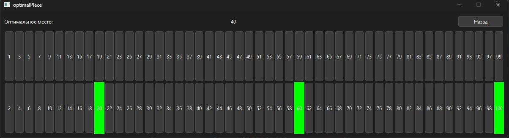

### C++ realization

This algorithm finds the most remote place in dressing room, taking into account occupied places

```c++
void findOptimal(vector<int>&chosenPlaces) {
	sort(chosenPlaces.begin(), chosenPlaces.end());

	bool hasLeft = (std::find(chosenPlaces.begin(), chosenPlaces.end(), 1) != chosenPlaces.end());
	bool hasRight = (std::find(chosenPlaces.begin(), chosenPlaces.end(), 100) != chosenPlaces.end());

	int leftDistance = 0;
	if (!hasLeft) {
		leftDistance = chosenPlaces[0] - 1;
	}
	else {
		leftDistance = 0; 
	}

	int rightDistance = 0;
	if (!hasRight) {
		rightDistance = 100 - chosenPlaces.back();
	}
	else {
		rightDistance = 0; 
	}

	int maxDistance = 0;
	int optimalPlace = 0;
	
	for (int i = 1; i < chosenPlaces.size(); ++i) {
		int distance = (chosenPlaces[i] - chosenPlaces[i - 1]) / 2;
		if (distance > maxDistance) {
			maxDistance = distance;
			optimalPlace = chosenPlaces[i] - distance;
		}
	}

	if (leftDistance > maxDistance && leftDistance > rightDistance) {
		chosenPlaces.push_back(1);
	}
	else if (rightDistance > maxDistance && rightDistance > leftDistance) {
		chosenPlaces.push_back(100);
	}
	else {
		chosenPlaces.push_back(optimalPlace);
	}
}
```

### Qt app



Ссылка на zip архив с exe:

https://drive.google.com/file/d/1QTJoWHnFKoL6jOMMWJdORZs-FxDNjPxY/view?usp=sharing